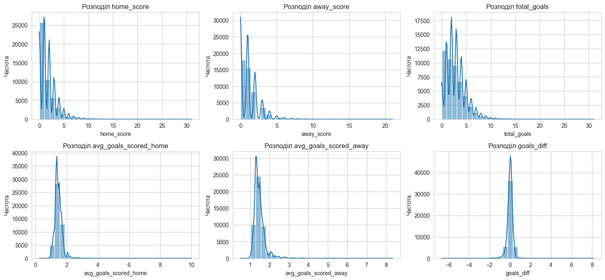
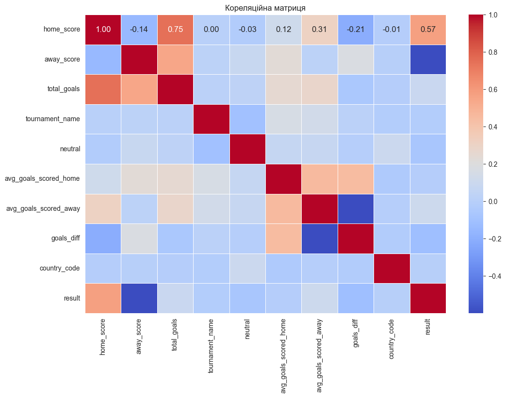
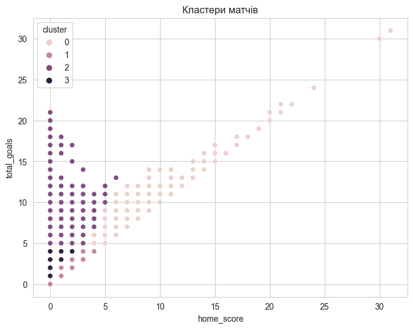
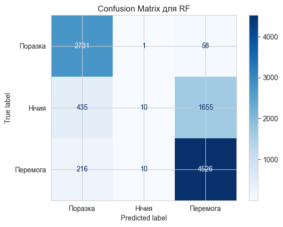
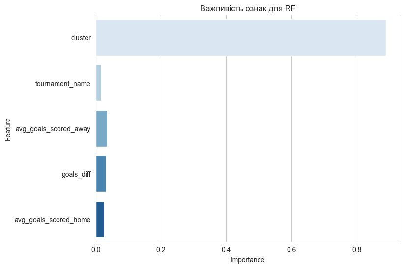
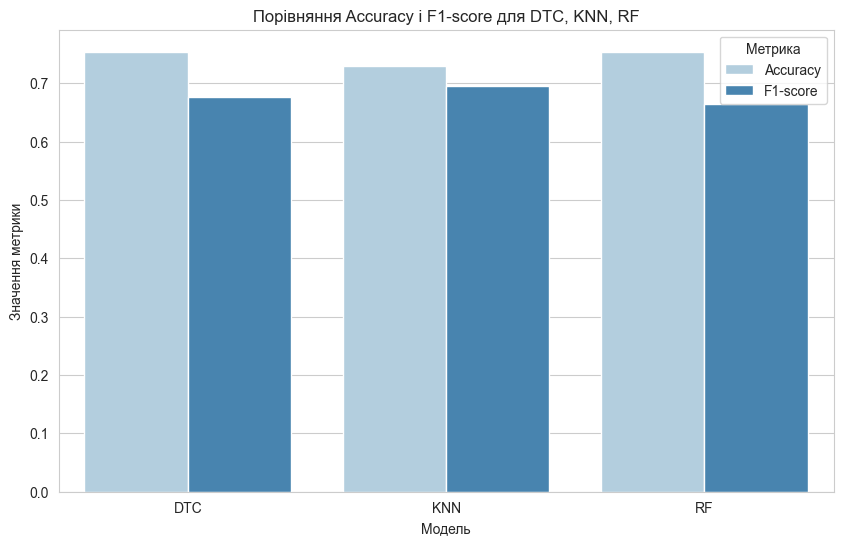

# Football Match Prediction — ML Project

A machine learning project focused on predicting outcomes of international football matches using classical ML models.
Project includes data extraction from PostgreSQL, preprocessing, feature engineering, model training, and evaluation.

## Project Overview

This project builds a complete ML pipeline for predicting football match results based on historical match statistics.

The workflow includes:
- Data extraction from a PostgreSQL Data Warehouse
- ETL preprocessing (clean to transformed to model-ready dataset)
- Feature engineering (goal stats, team performance metrics)
- Model training (Decision Tree, KNN, Random Forest)
- Unsupervised clustering (K-Means)
- Evaluation using Accuracy, F1-score, ROC-AUC
- Visualization of distributions, correlations, and predictions

## Features & Techniques

- ETL pipeline for preparing match data
- Feature engineering: goal difference, avg goals, encoded result variable
- ML models: Decision Tree Classifier, K-Nearest Neighbors, Random Forest
- Clustering: K-Means + silhouette score
- Visualization: seaborn, matplotlib
- Hyperparameter tuning: GridSearchCV for best K in KNN
- Train-test split: classical evaluation workflow

## Data Analysis

### Goals Distribution

### Correlation Heatmap

## 🤖 Unsupervised Learning

### K-Means Elbow Method

### Cluster Visualization

## 🧪 Model Evaluation

### Confusion Matrix (Random Forest)

### Feature Importance (Random Forest)

### Accuracy / F1 Comparison

## Technologies Used

- Python
- pandas, numpy
- seaborn, matplotlib
- scikit-learn (DecisionTree, KNN, RandomForest, KMeans)
- SQLAlchemy
- PostgreSQL
- statsmodels (SARIMAX)

## Installation

pip install -r requirements.txt

## Data Source

The dataset is based on international football match statistics loaded from a PostgreSQL fact table (fact_matches) and transformed inside the notebook.
